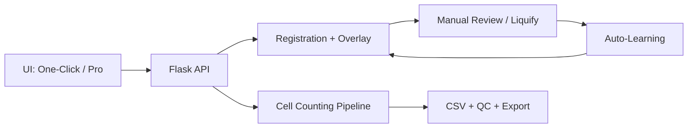
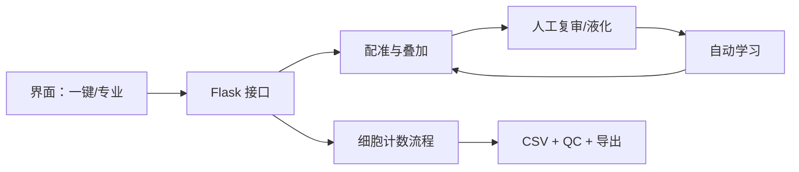

# IdleBrain

## English
IdleBrain is a practical workspace for brain atlas alignment, manual calibration, and whole-brain cell counting.

Primary code and docs are in [project/README.md](project/README.md), including:
- UI and CLI quick start
- atlas alignment and overlay workflow
- manual liquify correction + calibration learning loop
- output files and troubleshooting

### Architecture (EN)

## 中文
IdleBrain 是一个用于脑图谱配准、人工校准与全脑细胞计数的实用工作区。

完整双语说明请查看 [project/README.md](project/README.md)，其中包含：
- 图形界面与命令行快速开始
- 图谱配准与叠加流程
- 液化微调与校准学习闭环
- 输出说明与常见问题排查

### 架构图（中文）

## Main Code / 核心代码
- `project/`: pipeline, configs, scripts, frontend, docs.

## Ignored Large Artifacts / 未纳入版本管理的大体积内容
- `Samples/`: microscope sample data.
- `repos/`: third-party upstream repository.
- `project/frontend/build`, `project/frontend/dist`: desktop build artifacts.

## License / 许可证
This project is licensed under the GNU Affero General Public License v3.0 (AGPL-3.0).

本项目采用 GNU Affero General Public License v3.0（AGPL-3.0）许可证。

See [LICENSE](LICENSE) for details.
