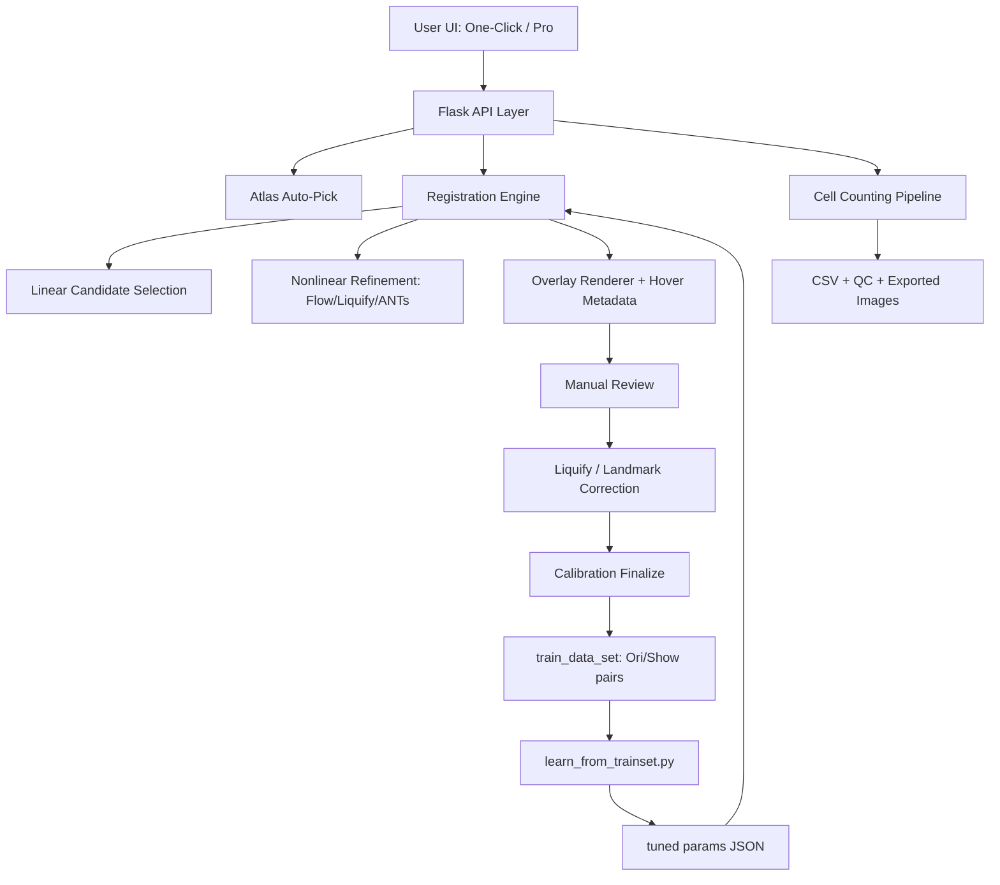
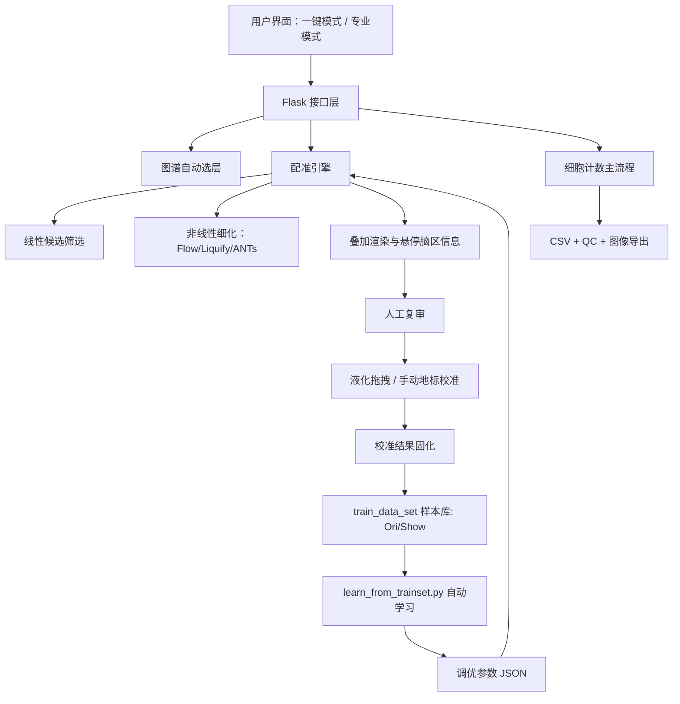

# IdleBrain / IdleBrain 脑图谱配准与细胞计数工具

## Overview / 项目简介
IdleBrain is a practical workflow for atlas alignment, manual correction, and whole-brain cell counting from microscopy TIFF data.

IdleBrain 是一个面向真实实验流程的工具链，用于显微切片的图谱配准、人工微调校准以及全脑细胞计数统计。

This repository currently contains an MVP + iterative improvements focused on better atlas fitting quality (especially internal boundaries) and reproducible outputs.

当前仓库包含 MVP 与持续迭代版本，重点是提升图谱贴合质量（尤其内部边界）并保证结果可复现。

## Key Features / 主要功能
- Allen atlas slice auto-pick from annotation volume (`annotation_25.nii.gz`).
- Tissue-guided initial registration with full/half-brain candidate competition.
- Nonlinear refinement (flow, liquify-like field, optional ANTs candidate with safety guardrails).
- Fill/contour overlay rendering with region hover query (acronym, parent, ID, color).
- Manual landmark correction and re-alignment.
- Liquify-style drag correction in preview mode.
- Save calibration samples and auto-learn tuned parameters from train set.
- Multi-channel cell counting pipeline with QC exports.

- 从 Allen 标注体中自动选择最合适的切片。
- 组织掩膜引导的初始配准，支持全脑/半脑候选竞争。
- 非线性细化（光流、液化式场、可选 ANTs 候选与安全约束）。
- 色块/轮廓叠加与鼠标悬停脑区信息查询（缩写、父级、ID、颜色）。
- 手动地标纠偏并重新配准。
- 预览区液化式拖拽微调。
- 保存人工校准样本，并基于训练集自动学习参数。
- 多通道细胞计数与 QC 结果导出。

## Workflow Modes / 两套流程模式
### One-Click Mode (Recommended) / 一键模式（推荐）
- Select source TIFF.
- Choose registration scope:
  - `Single-layer`: includes an extra Z-layer selection step for 3D TIFF.
  - `Whole-brain`: runs a stronger default alignment path and then enters review.
- Click start.
- System auto-runs: atlas auto-pick -> preview registration -> AI alignment.
- Enter manual review/calibration stage.
- Export preview/result in scientific image formats (`png`, `tif`, `jpg`, `bmp`).

- 选择源 TIFF。
- 选择配准范围：
  - `Single-layer`：3D TIFF 会多一步 Z 层选择。
  - `Whole-brain`：默认走更强的配准路径后进入复审。
- 点击开始。
- 系统自动执行：图谱自动选层 -> 预配准预览 -> AI 配准。
- 进入人工复审/校准阶段。
- 可导出常用科学图像格式（`png`、`tif`、`jpg`、`bmp`）。

### Professional Mode / 专业模式
- Full control of atlas file path, registration parameters, overlay options, and alignment strategy.
- Supports custom tuning and manual intervention at every stage.

- 可在流程开始前修改图谱文件、配准参数、叠加参数与配准策略。
- 支持每个阶段的细粒度调优与人工干预。

## Architecture Diagram (EN)


## 架构图（中文）


## Repository Layout / 仓库结构
- `project/configs/`: run configs and atlas structure metadata.
- `project/scripts/`: core processing, registration, rendering, evaluation scripts.
- `project/frontend/`: Flask backend + browser UI + desktop packaging assets.
- `project/outputs/`: generated overlays, labels, CSVs, tuning results.
- `project/train_data_set/`: paired samples used for registration parameter learning (`*_Ori.png`, `*_Show.png`).

## Quick Start (UI) / 图形界面快速开始
### Option A: Desktop EXE / 桌面版
- Run `project/frontend/dist/IdleBrainUI.exe`.

### Option B: Dev mode / 开发模式
```bash
cd project/frontend
python server.py
```
Open `http://127.0.0.1:8787`.

## Quick Start (CLI) / 命令行快速开始
```bash
cd project
python scripts/main.py --config configs/run_config.template.json --make-sample-tiff outputs/sample_input
python scripts/main.py --config configs/run_config.template.json --init-registration
python scripts/main.py --config configs/run_config.template.json --run-real-input outputs/sample_input
```

## UI Workflow / 推荐操作流程
1. Fill required paths (`Input TIFF Folder`, atlas annotation, structure CSV, real slice path, atlas label path).
2. Click `Refresh Preview` to inspect initial overlay.
3. Run `AI Landmark Registration` (Affine or Nonlinear).
4. Optional manual correction:
   - Manual landmark mode, or
   - Liquify drag in preview canvas for boundary micro-adjustment.
5. Click `Save Calibration + Learn` to store corrected sample and launch auto-learning.
6. Run pipeline for single channel or all channels.
7. Review CSV + QC outputs in `project/outputs`.

1. 填写必要路径（输入 TIFF 文件夹、atlas annotation、结构映射 CSV、真实切片路径、图谱切片路径）。
2. 点击 `Refresh Preview` 检查初始叠加效果。
3. 执行 `AI Landmark Registration`（Affine 或 Nonlinear）。
4. 如需人工微调：
   - 使用手动地标模式，或
   - 在预览画布使用 Liquify 拖拽做边界局部修正。
5. 点击 `Save Calibration + Learn` 保存校准样本并启动自动学习。
6. 运行单通道或全通道计数流程。
7. 在 `project/outputs` 查看 CSV 与 QC 输出。

## Calibration Learning Loop / 校准学习闭环
### Input pair format / 训练样本格式
- `N_Ori.png`: original real slice (grayscale/RGB view).
- `N_Show.png`: manually corrected overlay target.

### Default self-learning and sample cap / 默认自学习与样本库阈值
- Manual calibration finalize uses auto-learning by default (`Auto-learn` enabled).
- Each accepted calibration can append one `Ori/Show` pair to `train_data_set`.
- To avoid unbounded growth, the server enforces a sample cap:
  - env: `IDLEBRAIN_MAX_CALIB_SAMPLES`
  - default: `180`
  - old pairs are pruned automatically when the cap is exceeded.

- 人工校准固化后默认启用自动学习（`Auto-learn` 默认开启）。
- 每次确认的校准结果会新增一组 `Ori/Show` 样本到 `train_data_set`。
- 为防止样本库无限增长，服务端有阈值保护：
  - 环境变量：`IDLEBRAIN_MAX_CALIB_SAMPLES`
  - 默认值：`180`
  - 超阈值时自动裁剪旧样本。

### Tuning script / 调参脚本
```bash
cd project
python scripts/learn_from_trainset.py \
  --train-dir train_data_set \
  --annotation annotation_25.nii.gz \
  --out-json outputs/trainset_tuned_params.json
```

### Use tuned params in batch tests / 使用调优参数跑测试
```bash
cd project
python -m scripts.run_overlay_test \
  --real "<real_c1.tif>" \
  --real "<real_c0.tif>" \
  --annotation "annotation_25.nii.gz" \
  --outputs-root "outputs" \
  --tuned-params-json "outputs/trainset_tuned_params.json"
```

## Main Outputs / 主要输出文件
- `outputs/overlay_preview.png`
- `outputs/overlay_compare.png`
- `outputs/overlay_compare_nonlinear.png`
- `outputs/overlay_label_preview.tif`
- `outputs/cells_detected.csv`
- `outputs/cells_dedup.csv`
- `outputs/cells_mapped.csv`
- `outputs/cell_counts_leaf.csv`
- `outputs/cell_counts_hierarchy.csv`
- `outputs/slice_qc.csv`
- `outputs/qc_overlays/*.png`
- `outputs/trainset_tuned_params.json`
- `outputs/manual_calibration/*`

## Troubleshooting / 常见问题
- Preview fails: check that real slice and atlas label paths are valid and readable.
- Poor alignment: try nonlinear mode, increase landmarks, or reduce RANSAC residual.
- Fill mode too rough at boundary: use liquify drag micro-correction and save calibration.
- Learning not improving: inspect `train_data_set` sample quality and class balance.

- 预览失败：确认真实切片与图谱切片路径存在且可读。
- 配准较差：尝试非线性模式、增加地标数量、降低 RANSAC 残差。
- 色块边界粗糙：使用 Liquify 拖拽局部微调后再保存校准。
- 学习效果不稳定：检查 `train_data_set` 样本质量与覆盖多样性。

## Additional Docs / 其他文档
- `ATLAS_OVERLAY_GUIDE.md`: concise operation checklist.
- `USER_MANUAL.md`: detailed Chinese user manual.
- `frontend/README.md`: frontend/backend bridge details.

## License / 许可证
IdleBrain is released under GNU AGPL-3.0.

IdleBrain 采用 GNU AGPL-3.0 许可证发布。

See [`../LICENSE`](../LICENSE) for full text.

---
Last updated / 最后更新: 2026-03-13
