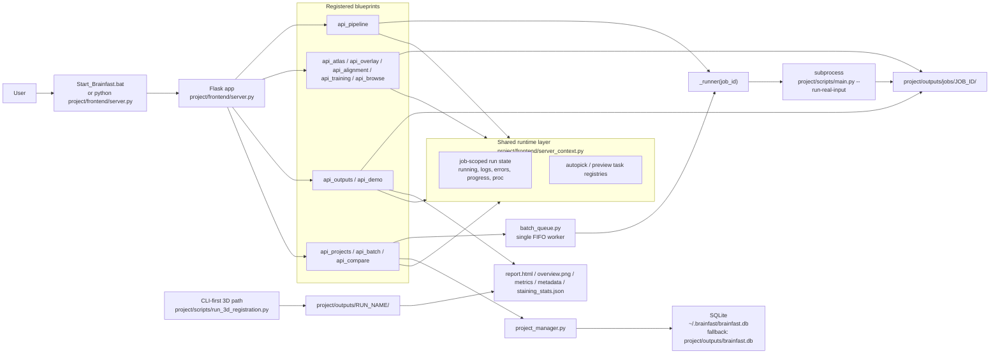
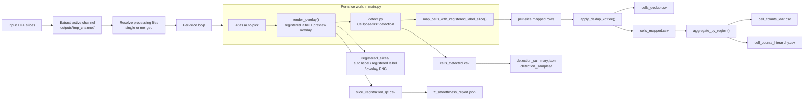
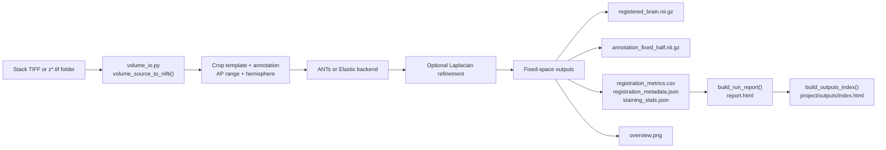

# Brainfast

## Overview

Brainfast is a local atlas-registration and cell-counting tool for cleared-brain microscopy data.

The repository currently has two main processing paths:

1. A 2D slice pipeline for slice registration, cell detection, deduplication, region mapping, and count aggregation.
2. A 3D volume pipeline for stack conversion, volumetric registration, staining statistics, and per-run HTML reports.

The browser/desktop UI is the main entry point. The Python scripts remain the most direct way to reproduce runs and debug the pipeline.

## Architecture

### Runtime architecture



### 2D execution path



### 3D execution path



### Architecture invariants

- The UI starts the 2D slice pipeline through a background runner thread. That runner launches `project/scripts/main.py` as a subprocess.
- A run is isolated by `job_id`. Runtime state lives in `server_context._job_states`, and UI/API outputs live in `project/outputs/jobs/<job_id>/`.
- The 3D path is currently CLI-first. The frontend reads generated 3D report folders through `api_outputs`; it does not yet own the full 3D execution loop.
- Batch processing is serialized today. `batch_queue.py` uses one FIFO worker thread and starts one runner thread per queued sample.
- Project and sample metadata are persisted in SQLite through `database.py` and `project_manager.py`.

## What Is In The Codebase Today

The current tree already includes:

- A Flask UI in `project/frontend/server.py`
- Atlas auto-pick, registration preview, manual correction, and calibration sample capture
- A Cellpose-first counting path on single slices
- Job-scoped outputs and status polling for UI/API runs
- 3D registration reports, overview images, and staining statistics
- Backend services for projects, samples, batch queueing, and cross-sample comparison

Important limits:

- Brainfast is a workstation tool, not a multi-user service
- The project/batch backend exists now; frontend integration is still evolving
- The 3D path is usable, but it is still under active iteration

## Repository Layout

| Path | Purpose |
| --- | --- |
| `project/configs/` | Runtime configs, Allen metadata, sample configs |
| `project/docs/` | Main documentation and supporting notes |
| `project/frontend/` | Flask app, static assets, desktop launcher |
| `project/outputs/` | Default outputs, reports, runtime artifacts |
| `project/scripts/` | Registration, detection, mapping, reports, utility scripts |
| `project/tests/` | Unit and integration tests |
| `project/train_data_set/` | Manual calibration pairs and learning data |
| `Sample/` | Local samples and reference material |

## Requirements

- Python 3.10 or newer
- Windows is the primary target environment
- An NVIDIA GPU is strongly recommended for Cellpose-based counting
- Allen assets bundled in the repository, including:
  - `project/annotation_25.nii.gz`
  - `project/configs/allen_mouse_structure_graph.csv`
  - `project/configs/allen_structure_tree.json`

## Installation

All commands below assume the repository root, for example `D:\Brainfast`.

```powershell
python -m venv .venv
.venv\Scripts\Activate.ps1
python -m pip install --upgrade pip
pip install -e ".[advanced,dev]"
```

Notes:

- `advanced` installs optional packages used by ANTs, SimpleITK, and Cellpose.
- `dev` installs test and lint tooling.
- `pip install -e .` is enough if you only need the basic UI and scripts first.

## Starting Brainfast

### Recommended launcher

From the repository root:

```powershell
.\Start_Brainfast.bat
```

That launcher delegates to `project/frontend/StartBrainfast.bat`, checks the runtime, and starts the desktop wrapper.

### Direct server entry

```powershell
python project\frontend\server.py
```

Open:

```text
http://127.0.0.1:8787
```

### Environment check first

```powershell
python project\scripts\check_env.py --config project\configs\run_config.template.json
```

## 2D Slice Pipeline

Main entry:

```powershell
python project\scripts\main.py --config project\configs\run_config_35_quick.json
```

The 2D pipeline does the following:

1. Reads source TIFF files and extracts the active channel.
2. Chooses single-slice or merged-slice processing from the config.
3. Auto-picks the atlas layer and registers each slice.
4. Writes `slice_registration_qc.csv`.
5. Runs cell detection.
6. Deduplicates detections across neighboring slices.
7. Maps detections into atlas regions.
8. Writes leaf-level and hierarchy-level counts.
9. Generates result overlays and confidence samples for review.

The frontend runs a preflight step before starting a job, then polls job-scoped status and error logs while the pipeline is running.

## 3D Registration Pipeline

Main entry:

```powershell
python project\scripts\run_3d_registration.py --config project\configs\run_config_3d_ants_sample.json
```

Useful sample configs:

- `project/configs/run_config_3d_sample.json`
- `project/configs/run_config_3d_ants_sample.json`
- `project/configs/run_config_3d_ants_miki_like_sample.json`

The 3D pipeline does the following:

1. Builds a 3D volume from a stack TIFF or `z*.tif` folder.
2. Crops the template and annotation to the AP range and hemisphere.
3. Registers the volume with ANTs or Elastix.
4. Optionally runs Laplacian refinement.
5. Generates:
   - `report.html`
   - `overview.png`
   - `registration_metrics.csv`
   - `registration_metadata.json`
   - `staining_stats.json`

Each 3D run lives in its own folder. The generated report pages are collected by `index.html` in the selected outputs root.

## Output Layout

### Default CLI outputs

Command-line runs write to:

```text
project/outputs/
```

### UI/API job outputs

UI and API jobs write to:

```text
project/outputs/jobs/<job_id>/
```

Each job keeps its own runtime config, logs, intermediate files, and results.

### Common output files

| File | Purpose |
| --- | --- |
| `cells_detected.csv` | Raw detections |
| `cells_dedup.csv` | Deduplicated detections |
| `cells_mapped.csv` | Detections mapped to atlas regions |
| `cell_counts_leaf.csv` | Leaf-region counts |
| `cell_counts_hierarchy.csv` | Counts aggregated through the Allen hierarchy |
| `detection_summary.json` | Detector choice, sampling mode, totals |
| `detection_samples/` | Three real detection-confidence slices |
| `slice_registration_qc.csv` | Per-slice registration metrics |
| `z_smoothness_report.json` | Z-axis continuity analysis output |
| `staining_stats.json` | Coverage, positive fraction, and related staining stats |
| `index.html` | 3D report index |
| `<run_name>/report.html` | Detailed report for one 3D run |

## Project, Batch, and Compare Services

The repository already contains backend services for project and sample management:

- Project and sample APIs: `project/frontend/blueprints/api_projects.py`
- Batch queue APIs: `project/frontend/blueprints/api_batch.py`
- Cross-sample compare API: `project/frontend/blueprints/api_compare.py`

SQLite storage location:

- Preferred: `~/.brainfast/brainfast.db`
- Fallback: `project/outputs/brainfast.db`

Treat this layer as workstation-oriented management infrastructure, not a finished multi-user product.

## Tests And Checks

Run commands from the repository root.

### Unit tests

```powershell
python -m pytest project/tests/unit -v
```

### Full test suite

```powershell
python -m pytest -v
```

### Ruff

```powershell
ruff check project/scripts/ project/frontend/blueprints/ project/frontend/server_context.py
ruff format --check project/scripts/ project/frontend/blueprints/ project/frontend/server_context.py
```

Notes:

- Do not `cd project` first if the tests import `project.frontend...`.
- CI runs the unit tests from the repository root.

## Additional Notes

- The root README is only a language switch entry point now.
- This folder is the only maintained documentation home.
- Internal 3D notes remain in [internal_3d_sample_workflow.md](internal_3d_sample_workflow.md).
- If a document and the code disagree, trust the current code and test behavior.
