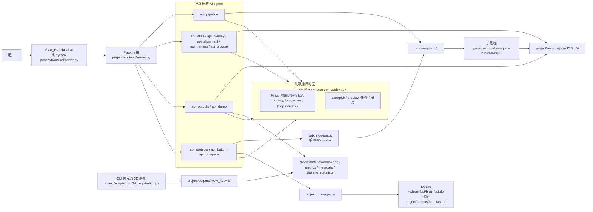
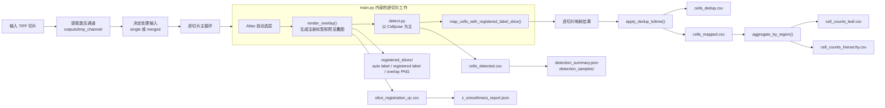
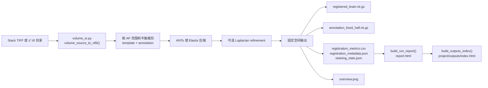

# Brainfast

## 项目概览

Brainfast 是一个本地运行的脑图谱配准与细胞计数工具，面向清脑样本和 lightsheet TIFF 数据。

当前代码库有两条主线：

1. 二维切片流程：逐张切片配准、细胞检测、去重、脑区映射、分层统计。
2. 三维体积流程：把 Z-stack 转成 NIfTI，做体积配准，生成报告页、指标和总览图。

浏览器 / 桌面界面是主要入口，命令行脚本仍然是最直接的复现和调试方式。

## 系统架构

### 运行时架构图



### 二维主流程架构图



### 三维主流程架构图



### 当前必须成立的架构约束

- 前端启动的是二维切片主流程，方式是后台 runner 线程再拉起 `project/scripts/main.py` 子进程。
- 每次运行都由 `job_id` 隔离。运行时状态保存在 `server_context._job_states`，前端 / API 的 job 输出目录在 `project/outputs/jobs/<job_id>/`。
- 三维流程目前仍是 CLI 优先，前端主要负责读取 `api_outputs` 暴露出来的 3D 报告目录，而不是直接托管整条 3D 执行链。
- 批处理当前是串行模型。`batch_queue.py` 里只有一个 FIFO worker，同一时刻只跑一个样本。
- 项目 / 样本元数据通过 `database.py` 和 `project_manager.py` 写入 SQLite。

## 当前代码范围

当前仓库已经包含这些能力：

- Flask 前端，入口在 `project/frontend/server.py`
- Atlas 自动选层、配准预览、人工矫正、训练样本沉淀
- 以 Cellpose 为主的单切片计数路径
- 前端 / API 运行时的 `job` 隔离输出目录和状态轮询
- 三维配准报告、总览图、染色统计
- 项目 / 样本 / 批处理 / 跨样本对比的后端服务

需要明确的边界：

- 这是单机工具，不是多用户在线服务。
- 项目和批处理后端已经有了，前端整合还在继续推进。
- 三维流程已经可用，但仍在持续迭代。

## 仓库结构

| 路径 | 用途 |
| --- | --- |
| `project/configs/` | 运行配置、Allen 元数据、样例配置 |
| `project/docs/` | 主文档和补充说明 |
| `project/frontend/` | Flask 应用、静态资源、桌面启动器 |
| `project/outputs/` | 默认输出目录、报告、运行产物 |
| `project/scripts/` | 配准、检测、映射、报告、工具脚本 |
| `project/tests/` | 单元测试和集成测试 |
| `project/train_data_set/` | 人工校准样本和学习数据 |
| `Sample/` | 本地样本和参考材料 |

## 环境要求

- Python 3.10 及以上
- Windows 是当前主目标环境
- 细胞计数强烈建议使用 NVIDIA GPU
- 仓库内自带 Allen 资源文件，例如：
  - `project/annotation_25.nii.gz`
  - `project/configs/allen_mouse_structure_graph.csv`
  - `project/configs/allen_structure_tree.json`

## 安装

以下命令假设当前目录是仓库根目录，例如 `D:\Brainfast`。

```powershell
python -m venv .venv
.venv\Scripts\Activate.ps1
python -m pip install --upgrade pip
pip install -e ".[advanced,dev]"
```

说明：

- `advanced` 会安装 ANTs、SimpleITK、Cellpose 等可选依赖。
- `dev` 会安装 `pytest`、`ruff` 等开发工具。
- 如果只需要基础前端和脚本，可以先用 `pip install -e .`。

## 启动 Brainfast

### 推荐方式

从仓库根目录启动：

```powershell
.\Start_Brainfast.bat
```

这个入口会继续调用 `project/frontend/StartBrainfast.bat`，先检查环境，再启动桌面包装器。

### 直接启动前后端

```powershell
python project\frontend\server.py
```

浏览器地址：

```text
http://127.0.0.1:8787
```

### 先检查环境

```powershell
python project\scripts\check_env.py --config project\configs\run_config.template.json
```

## 二维切片流程

主入口：

```powershell
python project\scripts\main.py --config project\configs\run_config_35_quick.json
```

二维流程顺序如下：

1. 读取 TIFF，提取激活通道。
2. 按配置决定使用单切片还是合并切片作为处理输入。
3. 自动选 atlas 层并逐张配准。
4. 写出 `slice_registration_qc.csv`。
5. 运行细胞检测。
6. 对相邻切片的细胞做去重。
7. 把细胞映射到脑区标签。
8. 输出叶节点统计和层级统计。
9. 生成结果叠图和计数置信样本图。

前端在启动 job 之前会先做 preflight 检查，运行过程中按 `job` 轮询状态和错误日志。

## 三维配准流程

主入口：

```powershell
python project\scripts\run_3d_registration.py --config project\configs\run_config_3d_ants_sample.json
```

常见配置文件：

- `project/configs/run_config_3d_sample.json`
- `project/configs/run_config_3d_ants_sample.json`
- `project/configs/run_config_3d_ants_miki_like_sample.json`

三维流程顺序如下：

1. 从 stack TIFF 或 `z*.tif` 目录构建三维体数据。
2. 按 AP 范围和半脑裁剪模板与注释。
3. 使用 ANTs 或 Elastix 做体积配准。
4. 可选 Laplacian refinement。
5. 生成：
   - `report.html`
   - `overview.png`
   - `registration_metrics.csv`
   - `registration_metadata.json`
   - `staining_stats.json`

每个三维 run 都是独立目录，报告页会被汇总到对应输出根目录下的 `index.html`。

## 输出目录

### 默认命令行输出

命令行默认写到：

```text
project/outputs/
```

### 前端 / API job 输出

前端和 API 运行的 job 会写到：

```text
project/outputs/jobs/<job_id>/
```

每个 job 都保留自己的运行配置、日志、中间文件和最终结果。

### 常见输出文件

| 文件 | 作用 |
| --- | --- |
| `cells_detected.csv` | 原始检测结果 |
| `cells_dedup.csv` | 去重后的检测结果 |
| `cells_mapped.csv` | 已映射到脑区的细胞 |
| `cell_counts_leaf.csv` | 叶节点脑区统计 |
| `cell_counts_hierarchy.csv` | 层级聚合统计 |
| `detection_summary.json` | 检测器、采样方式、总数 |
| `detection_samples/` | 三张真实切片置信样本图 |
| `slice_registration_qc.csv` | 每张切片的配准指标 |
| `z_smoothness_report.json` | Z 方向连续性分析结果 |
| `staining_stats.json` | 染色覆盖率、阳性率等统计 |
| `index.html` | 三维报告入口页 |
| `<run_name>/report.html` | 单次三维 run 的详细报告页 |

## 项目、批处理与对比服务

仓库里已经有项目和样本管理相关的后端服务：

- 项目与样本接口：`project/frontend/blueprints/api_projects.py`
- 批处理队列接口：`project/frontend/blueprints/api_batch.py`
- 跨样本脑区对比接口：`project/frontend/blueprints/api_compare.py`

SQLite 数据库存储位置：

- 优先：`~/.brainfast/brainfast.db`
- 回退：`project/outputs/brainfast.db`

目前更适合把这部分看成“单机管理层基础设施”，而不是已经完全打磨好的多用户产品。

## 测试与检查

从仓库根目录运行。

### 单元测试

```powershell
python -m pytest project/tests/unit -v
```

### 全量测试

```powershell
python -m pytest -v
```

### Ruff

```powershell
ruff check project/scripts/ project/frontend/blueprints/ project/frontend/server_context.py
ruff format --check project/scripts/ project/frontend/blueprints/ project/frontend/server_context.py
```

说明：

- 如果测试里有 `import project.frontend...`，不要先 `cd project`。
- CI 现在按仓库根目录执行单测。

## 补充说明

- 根目录 README 现在只负责语言切换。
- 本目录是唯一维护的主文档目录。
- 三维补充说明在 [internal_3d_sample_workflow.md](internal_3d_sample_workflow.md)。
- 如果文档与代码不一致，以当前代码和测试结果为准。
